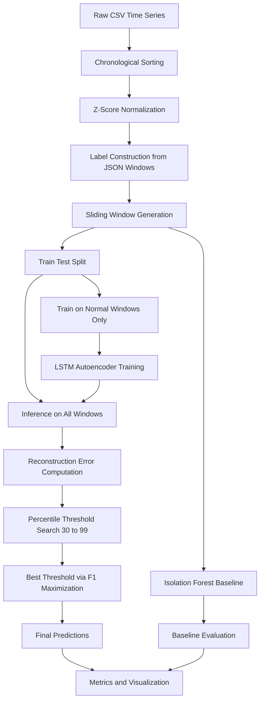

# Anomaly Detection in Time Series using LSTM Autoencoder

## Overview

This project implements an unsupervised anomaly detection system for univariate time-series data using a PyTorch-based LSTM Autoencoder.

The model is trained only on normal sequences and detects anomalies based on reconstruction error deviation.

A classical Isolation Forest baseline is included for comparison.

---

## Technical Architecture



---

## Model Architecture

The model is an LSTM Autoencoder:

* Encoder: LSTM processes the input sequence
* Latent space: linear projection of final hidden state
* Decoder: LSTM receives repeated latent-conditioned input
* Output: reconstructed sequence

### LSTM Autoencoder Structure


---

## Objective Function

$$
\mathcal{L} =
\frac{1}{B T}
\sum (X - \hat{X})^2
$$

---

## Anomaly Score

$$
S(X) =
\frac{1}{T}
\sum (X - \hat{X})^2
$$

Decision rule:

$$
S(X) > \tau
$$

---

## Training Strategy

* Train only on normal windows
* Testing using Full data
* Optimizer: Adam
* Loss: MSE

---

## CONFIG

```python
CONFIG = {
    "search_space": {
        "hidden_dim": [128],
        "latent_dim": [4],
        "num_layers": [1],
        "seq_len": np.arange(64, 320, 32)
    },
    "train": {
        "epochs": 50,
        "batch_size": 64,
        "lr": 1e-3
    },
    "threshold_percentiles": np.arange(30, 100, 1)
}
```

---

## Threshold Selection

* Reconstruction errors computed on normal training data
* Percentile sweep from 30% to 99%
* Best threshold selected via F1 maximization

---

## Evaluation Metrics

| Metric    | Description                 |
| --------- | --------------------------- |
| Precision | Correct anomaly predictions |
| Recall    | Detected anomalies          |
| F1 Score  | Balanced performance        |
| ROC-AUC   | Ranking quality             |
| PR-AUC    | Imbalanced robustness       |

---

## Baseline Model

### Isolation Forest

* Operates on flattened windows (T × 1)
* Unsupervised anomaly detection baseline
* Used for performance comparison

---

## Execution

```bash
pip install -r requirements.txt
python main.py
```

---

## Key Insight

The model learns normal temporal structure only.

Anomalies are detected when reconstruction error deviates significantly from the learned manifold.
